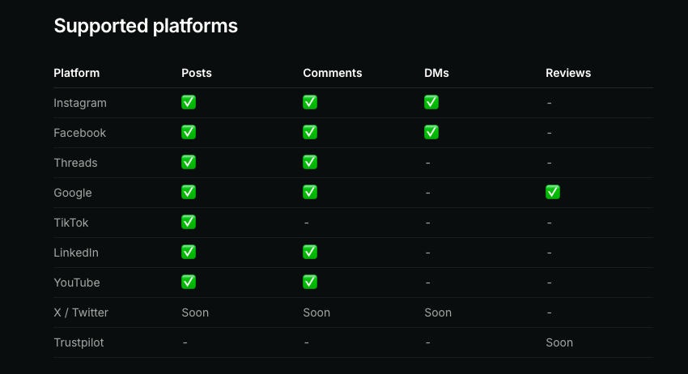

# 社交媒体管理工具综合调研报告

> 调研时间：2026-04-13
> 调研范围：商业 SaaS、开源项目、SDK/MCP 工具、评论管理专项

---

## 一、商业 SaaS 产品对比

### 1.1 主流产品定位

| 产品 | 定价起点 | 核心定位 | 适合用户 |
|------|----------|----------|----------|
| **Buffer** | $6/渠道/月 | 简单易用 + 性价比 | 个人/小团队/预算有限 |
| **Later** | $25/月 | 视觉优先 + Instagram | 视觉创作者/品牌 |
| **Hootsuite** | $99/月 | 企业级 + 全功能 | 中大型企业/多品牌 |
| **Sprout Social** | $199/用户/月 | 高级分析 + 社交 CRM | 数据驱动团队/代理 |
| **Agorapulse** | $99/用户/月 | 社交收件箱 + 倾听 | 团队协作/客户服务 |

### 1.2 关键差异分析

#### Buffer
- **优势**：最便宜的入门方案；免费版支持 3 个渠道；界面最简洁
- **劣势**：分析功能基础；无社交倾听；无白标选项
- **AI 功能**：AI Assistant 使用 GPT-4，但不拉取真实社交数据

#### Hootsuite
- **优势**：150+ 集成；9 个发布平台（30+ 社交监听网络）；AI（OwlyGPT）基于真实社交数据
- **劣势**：界面较拥挤；高级功能需单独购买
- **AI 功能**：OwlyGPT 可分析社交趋势、生成内容建议

#### Sprout Social
- **优势**：分析功能最强（300+ 指标）；社交倾听原生集成；Social CRM
- **劣势**：价格最高；按用户计费成本高
- **AI 功能**：BERT 模型做情感分析；ViralPost 智能发布时间

#### Agorapulse
- **优势**：社交收件箱体验最佳；社交倾听功能；协作功能强
- **劣势**：缺乏 AI 内容生成；按用户计费
- **AI 功能**：AI Writing Assistant（无额度限制）

### 1.3 统一收件箱（Unified Inbox）功能对比

所有主流 SaaS 都提供统一收件箱，但深度不同：

| 功能 | Hootsuite | Sprout Social | Agorapulse |
|------|-----------|--------------|------------|
| 多平台评论聚合 | ✅ | ✅ | ✅ |
| DM 管理 | ✅ | ✅ | ✅ |
| AI 分类/路由 | ✅ (Advanced) | ✅ | ❌ |
| 自动回复 | ✅ | ✅ | ✅ |
| SLA 优先级 | ✅ | ✅ | ✅ |
| 碰撞检测 | ✅ | ✅ | ❌ |
| 关键词流（Streams） | ✅ | ✅ | ❌ |
| 情感分析 | ✅ | ✅ | ❌ |

### 1.4 定价对比（2026）

| 产品 | 免费版 | Starter | Team | Enterprise |
|------|--------|---------|------|------------|
| Buffer | 3 渠道 | $6/渠道 | $12/渠道 | 定制 |
| Later | ✅ | $25 | $45 | $80+ |
| Hootsuite | ❌ | $99 | $249 | $739+ |
| Sprout Social | ❌ | $249/用户 | $399/用户 | $499/用户 |
| Agorapulse | 限制版 | $99/用户 | $149/用户 | $199/用户 |

### 1.5 API 与 MCP 支持对比

#### API 支持总览

| 产品 | 公开 API | 认证方式 | 主要能力 | API 限制 |
|------|----------|----------|----------|----------|
| **Buffer** | ✅ Beta | API Key（用户维度） | 发布内容到 11 个平台 | 不支持分析数据；已停止新开发者应用注册 |
| **Later** | ⚠️ 仅 Influence | JWT | 效果报告、影响者数据 | 仅限 Later Influence（网红营销模块），无内容发布 API |
| **Hootsuite** | ✅ REST API v1 | OAuth 2.0 | 发布调度、媒体上传、Webhook | 需申请开发者账号，企业功能受计划限制 |
| **Sprout Social** | ✅ Public API | OAuth 2.0 | 发布、报告、收件箱 | 需申请，按计划开放功能 |
| **Agorapulse** | ✅ REST API | OAuth 2.0 | 发布、分析、报告 | 付费计划可用 |

#### MCP 支持详情

| 产品 | MCP 支持 | 类型 | 工具/能力 | 备注 |
|------|----------|------|-----------|------|
| **Buffer** | ❌ | - | - | 无官方 MCP，API 仅 Beta，停止新 App 注册 |
| **Later** | ❌ | - | - | 无 MCP，无发布 API |
| **Hootsuite** | ⚠️ 社区 | 第三方 | 发布调度、管理 | `LokiMCPUniverse/hootsuite-mcp-server`；Zapier MCP 可间接集成 |
| **Sprout Social** | ⚠️ 社区 | 第三方 | 发布、分析、草稿 | `kodowjam/sprout-social-mcp-server`、`jmeserve/sprout-mcp`；官方维护 Java MCP SDK fork，Seeds 设计系统有 MCP 组件 |
| **Agorapulse** | ✅ 官方 Beta | 官方 | 内容草稿、数据分析、日历管理 | `@agorapulse/mcp`（npm），文档完整；Zapier MCP 可间接集成；**仅支持创建草稿，不支持直接发布** |

#### 关键差异分析

**Buffer**
- API 策略保守：仅提供基础发布能力，已停止接受新开发者应用注册
- 无 MCP 支持，AI Agent 集成路径缺失
- 适合简单自动化，不适合构建深度集成

**Hootsuite**
- REST API 成熟，有完整的 OAuth 2.0 + Webhook 体系
- MCP 仅有社区实现，官方未表态
- Zapier MCP 可作为无代码替代方案

**Sprout Social**
- API 最完整（覆盖发布、报告、Smart Inbox）
- 有多个社区 MCP Server，且官方维护 Java MCP SDK
- Seeds 设计系统中的 MCP Server 组件暗示有官方 MCP 规划

**Agorapulse**
- **五者中唯一有官方 MCP Server 的产品**
- `@agorapulse/mcp` 已发布到 npm，Beta 阶段免费
- 支持通过自然语言操作 Claude/ChatGPT/Copilot 管理社媒
- 限制：MCP 只能创建草稿，不能直接发布；Free/Legacy 计划不可用

**Later**
- API 仅限 Later Influence（网红营销模块），核心调度功能无 API
- 无 MCP 支持
- 开发者集成能力最弱

#### 与 Postiz 的对比

| 能力 | Postiz（开源） | Buffer | Hootsuite | Sprout Social | Agorapulse | Later |
|------|---------------|--------|-----------|---------------|------------|-------|
| 公开发布 API | ✅ 完整 | ✅ Beta | ✅ 成熟 | ✅ 成熟 | ✅ 成熟 | ❌ |
| 评论/收件箱 API | ❌ | ❌ | ✅ | ✅ | ✅ | ❌ |
| 官方 MCP Server | ✅ | ❌ | ❌ | ❌ | ✅ Beta | ❌ |
| MCP 评论管理 | ❌ | ❌ | ❌ | ❌ | ⚠️ 仅草稿 | ❌ |
| 自托管 | ✅ | ❌ | ❌ | ❌ | ❌ | ❌ |
| Webhook 支持 | ✅ | ❌ | ✅ | ✅ | ✅ | ❌ |

> **结论**：Postiz 和 Agorapulse 是商业产品中唯一有官方 MCP 支持的。Postiz 的 MCP 端点（`/api/mcp/{API_KEY}`）覆盖内容发布，若补充评论管理 MCP 工具，将在 AI Agent 集成深度上全面领先所有商业竞品。

### 1.6 评论读取与回复支持

#### 产品 UI 层：评论管理能力

| 产品 | 功能名称 | 支持平台 | 查看评论 | 回复评论 | 隐藏/删除 | 点赞评论 | DM 管理 | 广告评论 |
|------|----------|----------|----------|----------|-----------|----------|---------|---------|
| **Buffer** | Community | IG/FB/Threads/X/LI/TikTok/YT/Bluesky/Mastodon/GBP（10+） | ✅ | ✅ | ✅ | ✅ Beta | ✅ | ❌ |
| **Later** | Social Inbox | Instagram/Facebook/TikTok（3） | ✅ | ✅ | ✅ | ❌ | ✅（IG/FB DM） | ❌ |
| **Hootsuite** | Inbox 2.0 | IG/FB/X/LI/YT/TikTok/Threads（7+） | ✅ | ✅ | ✅ | ✅ | ✅ | ✅ |
| **Sprout Social** | Smart Inbox | IG/FB/X/LI/YT/TikTok/Pinterest（7+） | ✅ | ✅ | ✅ | ✅ | ✅ | ✅ |
| **Agorapulse** | Inbox | IG/FB/X/LI/YT/TikTok/Threads/Pinterest（8） | ✅ | ✅ | ✅ | ✅ | ✅ | ✅ |

#### API 层：评论读取与回复能力

| 产品 | 评论读取 API | 评论回复 API | API 端点/文档 | 限制说明 |
|------|------------|------------|--------------|---------|
| **Buffer** | ❌ | ❌ | 公开 API 无评论端点 | Community 功能仅限 UI；API Beta 阶段仅覆盖内容发布 |
| **Later** | ❌ | ❌ | 无评论 API | Social Inbox 仅限 UI；仅 Influence 模块有 Reporting API |
| **Hootsuite** | ✅ | ✅ | **Inbox 2.0 API** `apidocs.hootsuite.com/docs/api/inbox/` | 需高级计划；支持对话线程、状态管理、Webhook 推送 |
| **Sprout Social** | ✅（只读） | ⚠️ 有限 | `api.sproutsocial.com/docs` messages 端点 | 读取完整（含 Smart Inbox 消息）；写入 API 主要覆盖发布，评论回复支持有限，需确认 |
| **Agorapulse** | ✅ | ✅ | Open API + `/inbox` 端点 | 付费计划可用；2025 年新增 Threads 评论 API 支持 |

#### 平台级评论 API 支持矩阵（通过各产品 API 可读/回）

| 平台 | Buffer API | Later API | Hootsuite Inbox API | Sprout API | Agorapulse API |
|------|-----------|-----------|--------------------|-----------|-----------------|
| Instagram 评论 | ❌ | ❌ | ✅ | ✅ | ✅ |
| Facebook 评论 | ❌ | ❌ | ✅ | ✅ | ✅ |
| TikTok 评论 | ❌ | ❌ | ✅ | ✅ | ✅ |
| YouTube 评论 | ❌ | ❌ | ✅ | ✅ | ✅ |
| X/Twitter 评论 | ❌ | ❌ | ✅ | ✅ | ✅ |
| LinkedIn 评论 | ❌ | ❌ | ✅ | ✅ | ✅ |
| Threads 评论 | ❌ | ❌ | ✅ | ❌ | ✅（2025 新增）|
| Google Reviews | ❌ | ❌ | ❌ | ❌ | ✅ |
| DM（私信） | ❌ | ❌ | ✅ | ✅ | ✅ |

#### 关键差异总结

**Buffer**：评论管理是纯 UI 功能（Community 模块），公开 API 完全不支持评论读写。开发者无法通过 API 构建评论管理功能。

**Later**：同上，Social Inbox 仅限 UI。平台覆盖最窄（仅 3 个），无任何评论 API。

**Hootsuite**：有专用的 **Inbox 2.0 API**，是商业产品中评论 API 最完整的方案，支持读取评论/DM、回复、状态流转（assign/resolve）、Webhook 实时推送，覆盖 7+ 平台。需要高级订阅（Business 及以上）。

**Sprout Social**：Public API 的 messages 端点支持读取 Smart Inbox 中的消息（含评论），2025 年新增了 Case 管理 API 端点。评论**回复**写入能力文档不够清晰，主要写入能力集中在内容发布。适合读取+分析场景，回复需核实。

**Agorapulse**：Open API 支持完整的 Inbox 操作（读取+回复），覆盖 8 个发布平台（IG/FB/X/LI/YT/TikTok/Threads/Pinterest）。2025 年追加了 Threads 评论支持。MCP Server 可通过自然语言管理收件箱（但 MCP 本身目前只能创建草稿，直接回复需要调用 API）。

#### 对 Postiz 的启示

| 能力 | Postiz 现状 | 差距 |
|------|------------|------|
| 评论收件箱 UI | ❌ | 需实现统一收件箱页面 |
| 评论读取 API | ❌ | 需为各平台 Provider 实现 `getComments()` |
| 评论回复 API | ❌ | 需为各平台 Provider 实现 `replyComment()` |
| MCP 评论工具 | ❌ | 在现有 MCP 端点中注册 `list_comments`、`reply_comment` 工具 |
| Webhook 推送 | ❌ | 各平台评论 Webhook 注册 + Temporal 处理队列 |

> **优先级建议**：先实现 Instagram + Facebook + YouTube 的评论读取/回复 API（这 3 个平台官方 API 最完善），再扩展至 TikTok、LinkedIn、X。

---

## 二、开源项目深度对比

### 2.1 主要开源竞品一览

| 项目 | GitHub Stars | 技术栈 | 许可协议 | 平台数 | 特色 |
|------|--------------|--------|----------|--------|------|
| **Postiz** ⭐ | 27,996 | Next.js + NestJS + Temporal | AGPL-3.0 | 28+ | 最活跃，AI 功能完整 |
| **Mixpost** | 3,069 | Laravel + Vue | MIT | 11 | 成熟稳定，PHP 生态 |
| **Socioboard** | - | Node.js | GPL-3.0 | 9 | 完整分析 |
| **TryPost** | 16 | Laravel + Vue 3 | FSL | 5 | MCP 原生集成 |
| **PostFlow** | 28 | Next.js + Supabase | MIT | 2 | Threads + Instagram，AI 回复 |
| **Post4U** | 99 | FastAPI + Reflex | MIT | 5 | X, Reddit, Telegram, Discord |
| **LateWiz** | 24 | Next.js | MIT | 13 | 依赖 Zernio API |
| **auto-postit** | 1 | Node.js + React | MIT | 5 | 极简方案 |
| **social-scheduler** | 2 | Node.js + React | - | 9 | AI 内容生成 |

### 2.2 Postiz 架构分析（最接近本项目的开源方案）

```
┌─────────────────────────────────────┐
│        Frontend (Next.js + Vite)     │
│         SWR + Tailwind CSS          │
└──────────────┬──────────────────────┘
               │ HTTP REST API
┌──────────────▼──────────────────────┐
│      Backend API (NestJS)           │
│  Controller → Service → Repository  │
│  - 17+ Controllers                 │
│  - Prisma ORM                      │
└──────────────┬──────────────────────┘
               │ Temporal Workflows
┌──────────────▼──────────────────────┐
│   Orchestrator (Temporal + NestJS)  │
│  - 定时发布 · Token 刷新 · 邮件发送   │
│  - 任务队列（每平台独立）            │
└──────────────┬──────────────────────┘
               │
    ┌──────────┼──────────┐
    ▼          ▼          ▼
 PostgreSQL   Redis    AWS S3
```

**关键设计决策**：
- 使用 **Temporal** 实现可靠的任务调度（替代传统 cron）
- Provider 抽象模式：`SocialAbstract` 基类 + `XProvider`/`FacebookProvider` 等
- 通过 MCP 端点 `/api/mcp/{API_KEY}` 支持 AI Agent 集成
- 支持 N8N/Make.com/Zapier 自动化集成
- 支持 Node.js SDK (`@postiz/node`)

### 2.3 Mixpost 架构特点

```
┌─────────────────────────────────────┐
│        Frontend (Vue.js)            │
└──────────────┬──────────────────────┘
               │ HTTP
┌──────────────▼──────────────────────┐
│      Backend (Laravel)              │
│  - Queue + Redis                   │
│  - Socialite OAuth                 │
└──────────────┬──────────────────────┘
               │
    ┌──────────┼──────────┐
    ▼          ▼          ▼
 PostgreSQL   Redis    Storage
```

**特点**：
- Laravel 生态，稳定可靠
- MIT 许可，可商用
- 专注内容发布，简洁设计

### 2.4 开源项目缺失的功能

对比 Postiz 和商业产品，开源方案普遍缺少：

| 功能 | 商业 SaaS | 开源方案 |
|------|------------|----------|
| **统一评论收件箱** | ✅ 标配 | ❌ 大多数缺失 |
| **AI 评论审核/自动回复** | ✅ 标配 | ❌ 缺失 |
| **Social CRM（客户画像）** | ✅ Sprout/Hootsuite | ❌ 缺失 |
| **社交倾听（品牌监测）** | ✅ 高级计划 | ❌ 缺失 |
| **团队 SLA/碰撞检测** | ✅ 企业功能 | ❌ 缺失 |
| **广告评论管理** | ✅ | ❌ |
| **GDPR 合规** | 部分 | ❌ |

---

## 三、SDK / MCP 工具对比

### 3.1 统一 API 提供商



| 服务商 | 平台覆盖 | 评论/DM | Reviews | 定价模型 | MCP 支持 |
|--------|----------|---------|---------|----------|----------|
| **SocialAPI.ai** | 8 平台 | ✅ 完整 | ✅ | 请求量计费 | ✅ 42 工具 |
| **Zernio** | 8 平台 | ✅ 完整 | ❌ | $10/月 add-on | ❌ |
| **Outstand** | 10 平台 | ✅ 完整 | ✅ | $5/月 + $0.01/帖子 | ✅ 25 工具 |
| **Ayrshare** | 15+ 平台 | ✅ | ❌ | $49+/月 | ✅ |
| **Upload-Post** | 10 平台 | ❌ | ❌ | 请求量计费 | ❌ |
| **PostFast** | 8 平台 | ❌ | ❌ | 免费开始 | ✅ 10 工具 |
| **Postproxy** | 8 平台 | ❌ | ❌ | 免费开始 | ✅ |
| **SocialAPIs** | 1 平台 | ✅ | ❌ | $0-49/月 | ✅ |

### 3.2 SocialAPI.ai 详细分析

**平台支持矩阵**：

| Platform | Posts | Comments | DMs | Reviews | Mentions | Publishing |
|----------|-------|----------|-----|---------|----------|------------|
| Instagram | ✅ | ✅ | ✅ | - | ✅ | ✅ |
| Facebook | ✅ | ✅ | ✅ | - | ✅ | ✅ |
| Threads | ✅ | ✅ | - | - | - | ✅ |
| Google | ✅ | ✅ | - | ✅ | - | ✅ |
| TikTok | ✅ | - | - | - | - | ✅ |
| LinkedIn | ✅ | ✅ | - | - | - | ✅ |
| YouTube | ✅ | ✅ | - | - | - | ✅ |
| X/Twitter | Soon | Soon | Soon | - | Soon | - |

**特点**：
- 统一收件箱 API：`/v1/inbox/comments`、`/v1/inbox/conversations`
- MCP Server 42 工具
- OAuth 2.1 with PKCE
- Webhooks 支持

### 3.3 MCP Server 生态

| MCP Server | 工具数量 | 平台 | 特点 |
|------------|----------|------|------|
| **@socialneuron/mcp-server** | 64 | 跨平台 | 最完整，内容生成+分析+视频 |
| **Postproxy MCP** | ~10 | 8 平台 | 发布为主，远程/本地双模式 |
| **SocialAPIs MCP** | ~10 | Facebook | 专注数据获取 |
| **PostFast MCP** | 10 | 8 平台 | Claude 插件市场直装 |
| **Outstand MCP** | 25 | 10 平台 | 统一数据模型，3 分钟接入 |
| **2389-research/mcp-socialmedia** | ~8 | 自定义 | 通用框架，需对接后端 API |
| **Xenon-Flare/mcp-server** | ~10 | 自定义 | 视频/图片上传管理 |

### 3.4 MCP 集成模式

```
AI Agent (Claude/Cursor/VS Code)
        ↓ stdio 或 HTTP transport
MCP Server (npx @xxx/mcp-server)
        ↓ REST API
统一社交 API (SocialAPI.ai / Zernio / Outstand)
        ↓ 平台官方 API
Instagram / TikTok / X / LinkedIn / ...
```

**趋势**：
- MCP 正在成为 AI Agent 社交媒体操作的标配协议
- 统一 API 提供商正在将 MCP 作为差异化卖点
- 远程 MCP（HTTP transport）正在替代本地 stdio 安装
- Claude Code 插件市场出现（如 PostFast MCP）

### 3.5 统一 API 定价对比

| 服务商 | 免费额度 | 入门价格 | 计费方式 |
|--------|----------|----------|----------|
| SocialAPI.ai | ✅ | 取决于用量 | 请求量 |
| Zernio | ❌ | $10/月 | add-on |
| Outstand | ❌ | $5/月 | $0.01/帖子 |
| Ayrshare | ❌ | $49/月 | 订阅 |
| PostFast | ✅ | 免费 | 订阅升级 |
| Postproxy | ✅ | 免费 | 订阅升级 |

---

## 四、评论管理专项分析

### 4.1 市场分层

```
┌─────────────────────────────────────────────┐
│           企业级评论管理                      │
│  Respondology ($750M+ 广告保护)              │
│  Arwen Moderate (25+ 有害内容类型)           │
│  FeedGuardians (AI 审核)                    │
│  Conversario (出版商/媒体)                   │
└─────────────────────────────────────────────┘
┌─────────────────────────────────────────────┐
│           社交 SaaS 内置                     │
│  Hootsuite Inbox (AI 分类/路由)             │
│  Sprout Social Smart Inbox                  │
│  NapoleonCat (AI 建议回复)                  │
│  Agorapulse (社交倾听)                      │
└─────────────────────────────────────────────┘
┌─────────────────────────────────────────────┐
│           专用评论工具                       │
│  Reply200 (声音克隆回复)                    │
│  CommentGuard (FB/IG)                      │
│  PostSyncer (多平台统一)                    │
│  replient.ai (EU GDPR)                      │
└─────────────────────────────────────────────┘
```

### 4.2 AI 评论审核技术方案

| 技术方案 | 代表产品 | 原理 | 优缺点 |
|----------|----------|------|--------|
| **关键词规则** | TheSocialTools | 30K+ 分类关键词，28 语言 | 快但易绕过，假阳性高 |
| **LLM 情感分析** | Reply200 | GPT 类模型判断意图和语气 | 上下文理解好，延迟/成本高 |
| **专用分类模型** | Arwen Moderate | 训练有害内容检测模型 | 准确但需定制训练数据 |
| **混合方案** | Respondology | 规则 + LLM + 人工三层 | 最准确但成本最高 |

### 4.3 评论管理关键功能对比

| 功能 | Hootsuite | Sprout | NapoleonCat | PostSyncer | Reply200 | Arwen |
|------|-----------|--------|-------------|------------|----------|-------|
| 多平台统一收件箱 | ✅ | ✅ | ✅ | ✅ | FB/IG/TikTok | ✅ |
| AI 情感/意图检测 | ✅ | ✅ | ✅ | ✅ | ✅ | ✅ |
| 自动隐藏/删除 | ✅ | ✅ | ✅ | ✅ | ✅ | ✅ |
| AI 自动回复 | ✅ (Advanced) | ✅ | ✅ | ❌ | ✅ (声音克隆) | ❌ |
| FAQ 自动回复 | ✅ | ✅ | ✅ | ✅ | ❌ | ❌ |
| 广告评论管理 | ✅ | ✅ | ✅ | ❌ | ✅ | ✅ |
| DM 自动化 | ✅ | ✅ | ✅ | ❌ | ❌ | ❌ |
| SLA/优先级 | ✅ | ✅ | ✅ | ❌ | ❌ | ❌ |
| GDPR 合规 | ❌ | ❌ | ✅ (EU) | ❌ | ❌ | ❌ |

### 4.4 专用评论工具详情

#### Reply200
- **定价**：$29/月（3,000 评论）
- **特色**：声音克隆技术，从历史回复/帖子/bio 学习品牌语气
- **平台**：Facebook（广告+帖子+直播）、Instagram（广告+帖子）、TikTok
- **效果**：+25% 有机触达，+15% 点击率，99% 垃圾/毒性检测

#### Arwen Moderate
- **定价**：企业定制
- **特色**：25+ 有害内容类型，30 种语言，自动阴影禁言
- **平台**：Instagram、TikTok、Facebook、X、YouTube
- **功能**：图片检测、Emoji 过滤、加密机器人检测

#### replient.ai
- **定价**：€39/月起
- **特色**：EU 数据处理，100+ 预建工作流
- **平台**：Facebook、Instagram、TikTok、LinkedIn、YouTube、Google Reviews
- **功能**：AI 学习品牌历史数据，意图标签，自动优先排序

#### Respondology
- **定价**：企业定制
- **特色**：3 层保护（规则 + LLM + 人工），30K+ 关键词
- **平台**：Facebook、Instagram、TikTok、YouTube
- **数据**：98% 自动隐藏，1B+ 受保护粉丝，225M+ 已审核评论

---

## 五、综合对比矩阵

| 维度 | 商业 SaaS | 开源 (Postiz/Mixpost) | 统一 API | 评论专用工具 |
|------|------------------------------|----------------------|------------------------|--------------|
| **内容发布** | ⭐⭐⭐⭐⭐ | ⭐⭐⭐⭐ | ⭐⭐⭐⭐ | ⭐ |
| **评论收件箱** | ⭐⭐⭐⭐⭐ | ⭐ | ⭐⭐⭐⭐ | ⭐⭐⭐⭐⭐ |
| **AI 内容生成** | ⭐⭐⭐⭐ (付费) | ⭐⭐⭐⭐ | ⭐⭐⭐ | ⭐ |
| **AI 评论审核** | ⭐⭐⭐⭐ (高级) | ⭐ | ⭐⭐⭐ | ⭐⭐⭐⭐⭐ |
| **自托管** | ❌ | ✅ | ❌ | ❌ |
| **成本** | $99-499/月 | 免费 | $0-100/月 | $29-99/月 |
| **MCP 支持** | ❌ | ✅ (Postiz) | ✅ | ❌ |
| **平台覆盖** | 10+ | 28+ | 8+ | 3-8 |
| **团队协作** | ⭐⭐⭐⭐⭐ | ⭐⭐⭐ | ⭐⭐ | ⭐⭐ |
| **Social CRM** | ⭐⭐⭐⭐⭐ | ⭐ | ⭐ | ⭐ |

---

## 六、关键发现

### 6.1 市场空白

1. **开源 + 统一评论收件箱**：目前没有成熟的开源方案同时具备：
   - 多平台内容发布
   - 统一评论/DM 收件箱
   - AI 审核/自动回复
   - MCP Agent 集成

2. **统一 API + 评论管理**：大多数统一 API 提供商（如 SocialAPI.ai）已支持评论读写，但缺乏 AI 审核层

3. **MCP 原生集成**：只有少数开源项目（Postiz、TryPost）和统一 API 提供商支持 MCP

### 6.2 技术趋势

1. **MCP 正在标准化**：AI Agent 通过 MCP 访问社交媒体正在成为主流范式
2. **AI 评论审核普及化**：从企业专用走向 SMB 可负担（€39/月起）
3. **混合审核模式**：规则 + LLM + 人工三层组合成为最佳实践
4. **Temporal 替代 Cron**：可靠的工作流编排成为社交发布的事实标准
5. **声音克隆回复**：Reply200 开创了品牌语气克隆的先河

### 6.3 Postiz 的竞争优势

作为最活跃的开源竞品（27,996 ⭐），Postiz 已在以下方面领先：

| 能力 | Postiz 状态 |
|------|------------|
| 28+ 平台覆盖 | ✅ |
| Temporal 工作流编排 | ✅ |
| MCP Agent 集成 | ✅ |
| N8N/Make.com/Zapier 自动化 | ✅ |
| 统一评论收件箱 | ❌ |
| AI 评论审核/自动回复 | ❌ |
| Social CRM | ❌ |
| 社交倾听 | ❌ |

---

## 七、建议

### 7.1 差异化机会

Postiz 缺少的评论管理功能是明确的差异化机会：

```
┌─────────────────────────────────────────────────┐
│                  核心差异化                       │
│                                                 │
│  1. 统一评论/DM 收件箱（跨平台聚合）              │
│  2. AI 评论审核（垃圾/有害内容检测）              │
│  3. AI 自动回复（FAQ + 情感响应）                │
│  4. MCP 评论管理工具（Agent 原生集成）           │
│  5. Social CRM（客户画像 + 历史互动）            │
│  6. 社交倾听（品牌监测 + 竞品分析）              │
└─────────────────────────────────────────────────┘
```

### 7.2 技术建议

1. **复用统一 API**：集成 SocialAPI.ai 或 Zernio 处理平台对接，专注应用层
2. **引入 AI 审核层**：使用专用模型（如 Moderation API）或 LLM 做二次审核
3. **MCP 优先**：将评论管理作为 MCP 工具暴露，支持 AI Agent 自然语言操作
4. **Temporal 工作流**：使用 Temporal 实现评论审核状态机和自动回复队列
5. **渐进式实现**：
   - Phase 1：统一收件箱 + 基础过滤
   - Phase 2：AI 情感分析 + 意图分类
   - Phase 3：AI 自动回复 + FAQ 模板
   - Phase 4：Social CRM + 社交倾听

### 7.3 竞品参考

| 参考对象 | 学习点 |
|----------|--------|
| **Sprout Social** | Smart Inbox 设计、AI 分类、Contact Views |
| **Hootsuite** | Streams 关键词流、DM 自动化 |
| **NapoleonCat** | AI 回复建议、自动分类标签 |
| **Reply200** | 声音克隆、品牌语气学习 |
| **Respondology** | 三层审核架构、人工兜底 |
| **SocialAPI.ai** | 统一 API 设计、MCP 42 工具 |

---

## 附录：资源链接

### 开源项目
- Postiz: https://github.com/gitroomhq/postiz-app
- Mixpost: https://github.com/inovector/mixpost
- TryPost: https://github.com/trypost-it/trypost

### 统一 API
- SocialAPI.ai: https://social-api.ai
- Zernio: https://zernio.com
- Outstand: https://www.outstand.so
- PostFast: https://postfa.st

### MCP Servers
- @socialneuron/mcp-server: https://github.com/socialneuron/mcp-server
- Postproxy: https://postproxy.dev
- SocialAPIs MCP: https://github.com/SocialAPIsHub/mcp-server

### 评论管理
- Reply200: https://reply200.com
- Arwen Moderate: https://www.arwen.ai/comment-moderation
- replient.ai: https://replient.ai
- NapoleonCat: https://napoleoncat.com

---

*报告生成时间：2026-04-13*
